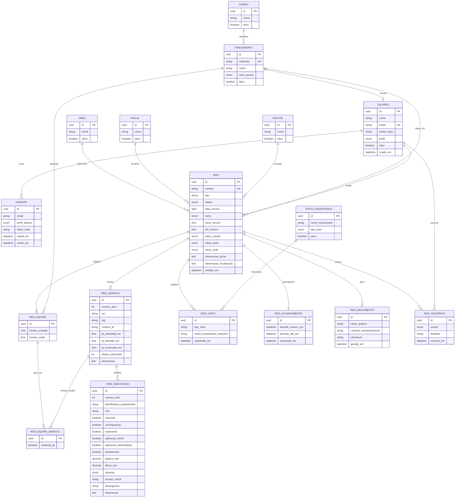
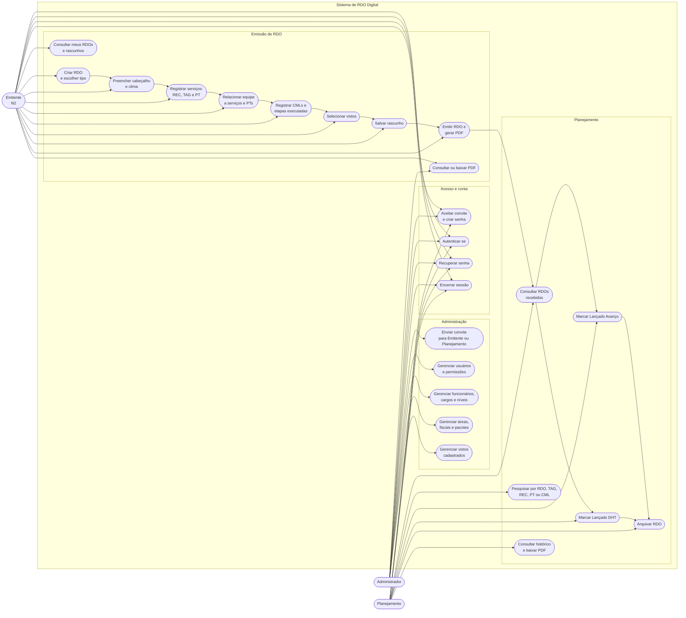
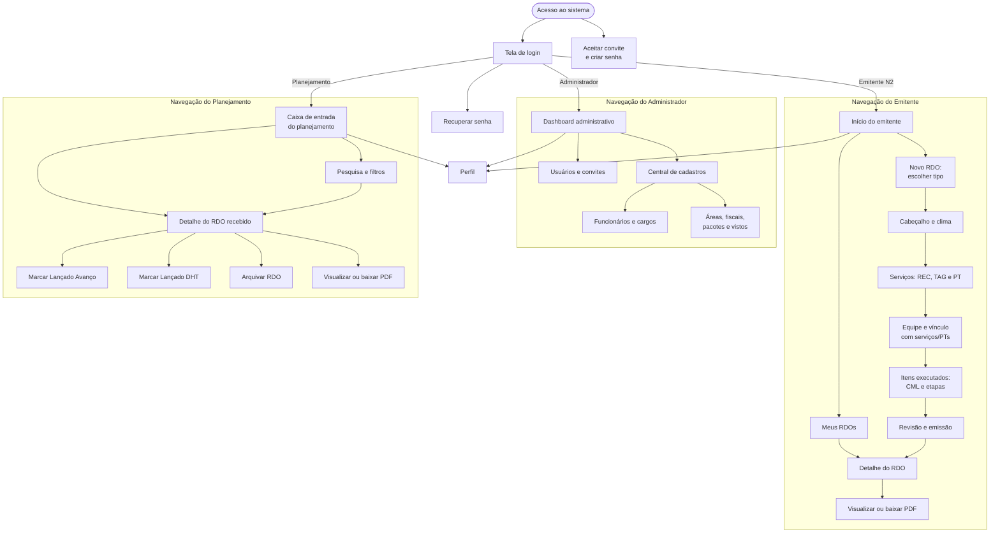

# Análise de Requisitos

## Sistema de Registro Diário de Obra (RDO) Digital

**Projeto:** Projeto de extensão - Análise e Desenvolvimento de Sistemas  
**Organização de referência:** Priner - atividades industriais atendidas para a Braskem  
**Escopo inicial:** Disciplina de Acesso por Cordas  
**Data de revisão:** 21 de julho de 2026

---

## 1. Visão geral

O Sistema de RDO Digital tem como objetivo digitalizar a emissão e o encaminhamento dos Registros Diários de Obra utilizados pela equipe de Acesso por Cordas. Atualmente, as informações do RDO são preenchidas manualmente e encaminhadas ao planejamento, que as utiliza para alimentar outros sistemas.

A aplicação reduzirá o tempo entre a emissão e o recebimento do RDO pelo planejamento, mantendo os dados organizados, pesquisáveis e rastreáveis.

## 2. Objetivo e escopo

### Objetivo

Permitir que o emitente registre o RDO em ambiente web, gere o documento digital e o encaminhe diretamente ao planejamento para acompanhamento e lançamento nos sistemas corporativos.

### Escopo do MVP

O MVP atenderá exclusivamente à disciplina de Acesso por Cordas, contemplando RDOs de isolamento e pintura em torres e tubulações.

O sistema deverá permitir:

- Cadastro e controle de usuários, perfis, funcionários, cargos, fiscais, responsáveis líderes, áreas e pacotes.
- Criação, edição, emissão, consulta e arquivamento de RDOs digitais.
- Geração de PDF com estrutura compatível com os modelos atuais de RDO.
- Acompanhamento pelo planejamento dos lançamentos de Avanço e DHT.

## 3. Perfis de acesso

| Perfil | Responsabilidades principais |
|---|---|
| Administrador | Gerencia usuários, cadastros base, perfis de acesso, áreas, fiscais, responsáveis líderes, pacotes, funcionários e cargos. |
| Emitente | Cria e revisa RDOs, informa serviços e equipe, seleciona vistos cadastrados, emite o documento e o encaminha ao planejamento. |
| Planejamento | Consulta RDOs recebidos, registra o lançamento em Avanço e/ou DHT e realiza o arquivamento conforme o fluxo definido. |

O acesso ao sistema não será público. Os usuários serão criados ou convidados pelo administrador.

## 4. Tipos de RDO

| Código | Tipo de RDO | Campos específicos do verso |
|---|---|---|
| RDO-IT | Isolamento de torres | Torre, CML, remoção, recomposição, largura e altura. |
| RDO-ITB | Isolamento de tubulações | TAG, CML, remoção, recomposição, largura e altura. |
| RDO-PT | Pintura de torres | Torre, CML, tratamento, aplicação de fundo, intermediária e acabamento. |
| RDO-PTB | Pintura de tubulações | TAG, CML, tratamento, aplicação de fundo, intermediária e acabamento. |

As etapas de remoção, recomposição, tratamento, aplicação de fundo, aplicação intermediária e acabamento serão campos marcáveis. Quando houver dimensão, largura e altura serão registradas em milímetros.

## 5. Estrutura do RDO

### 5.1 Frente: campos comuns

- **Cabeçalho:** área, fiscal, condições climáticas, pacote, data, turno, responsável líder e horário geral do serviço.
- **Condições climáticas:** Bom, Nublado ou Chuva para manhã, tarde e noite.
- **Distribuição de efetivo:** função, quantitativo N1, N2, N3 e efetivo total.
- **Tabela de serviços:** item, REC, TAG, número da PT, horários de solicitação, emissão e finalização da PT, efetivo e observações.
- **Relação de efetivo:** matrícula, nome, função, entrada, saída, itens de PT emitidos e itens de serviço executados.
- **Observações:** quadro de observações da Priner e quadro de observações da fiscalização.
- **Vistos:** seleção de vistos previamente cadastrados, sem assinatura eletrônica formal.

### 5.2 Classificação da equipe

| Nível | Descrição | Presença no RDO |
|---|---|---|
| N1 | Executantes de acesso por cordas. | Integram a relação de efetivo. |
| N2 | Encarregados de acesso por cordas. | Integram a relação de efetivo. |
| N3 | Supervisor geral e responsável líder. | É selecionado no cabeçalho e não integra a relação de efetivo. |

### 5.3 Verso: itens executados

Cada RDO poderá conter diversos itens executados. Todo item deverá possuir:

- Número sequencial.
- Identificação do equipamento: Torre ou TAG.
- Número CML.
- Situação de andamento ou conclusão.
- Escopo inicial, abrangência e observações.
- Campos técnicos específicos do tipo de serviço.

## 6. Requisitos funcionais

| ID | Requisito |
|---|---|
| RF01 | Permitir login, recuperação de senha e controle de sessão dos usuários autorizados. |
| RF02 | Permitir ao administrador cadastrar e manter usuários, funcionários, cargos, áreas, fiscais, responsáveis líderes e pacotes. |
| RF03 | Permitir a criação de RDO para um dos quatro tipos de serviço definidos no escopo. |
| RF04 | Preencher automaticamente a disciplina conforme o tipo de RDO selecionado. |
| RF05 | Registrar condições climáticas de manhã, tarde e noite com as opções Bom, Nublado ou Chuva. |
| RF06 | Registrar múltiplos serviços em um RDO, com REC, TAG, PT, horários, efetivo e observações. |
| RF07 | Registrar funcionários e relacioná-los a um ou mais itens de serviço e/ou itens de PT emitida. |
| RF08 | Calcular o efetivo total e a distribuição N1/N2 a partir da relação de efetivo; selecionar o N3 como responsável líder. |
| RF09 | Permitir marcar etapas técnicas e registrar dimensões em milímetros quando aplicável. |
| RF10 | Permitir registrar observações da Priner e da fiscalização. |
| RF11 | Permitir selecionar vistos previamente cadastrados, sem coleta de assinatura eletrônica formal. |
| RF12 | Permitir salvar RDO como rascunho, emitir, encaminhar ao planejamento e consultar o histórico. |
| RF13 | Gerar PDF do RDO com frente e verso compatíveis com os modelos operacionais. |
| RF14 | Permitir ao planejamento marcar os campos Lançado Avanço e Lançado DHT. |
| RF15 | Permitir o arquivamento do RDO digital; o campo Escaneado não será utilizado. |
| RF16 | Pesquisar RDOs por número, data, tipo, área, pacote, REC, TAG, PT, CML e status. |
| RF17 | Gerar número sequencial e imutável para o RDO no momento da emissão, seguindo inicialmente o padrão `RDO-AAAA-NNNNNN`. |

## 7. Regras de negócio

1. Um RDO será associado a somente um tipo de serviço, mas poderá possuir vários serviços e vários itens executados.
2. Um funcionário poderá estar relacionado a mais de um serviço e poderá ser emitente de mais de uma PT no mesmo RDO.
3. As referências impressas na relação de efetivo utilizarão o número do item da tabela de serviços. O sistema deverá gerar essas referências automaticamente no PDF.
4. O responsável líder será um profissional N3 e não fará parte da relação de efetivo N1/N2.
5. Os horários da PT deverão obedecer à sequência lógica: solicitação, emissão/liberação e encerramento.
6. O RDO emitido receberá número definitivo e não deverá ter seus dados alterados sem controle de revisão. Rascunhos poderão ser editados pelo emitente.
7. O planejamento será responsável pela atualização dos marcadores Lançado Avanço, Lançado DHT e Arquivado.

## 8. Fluxo operacional proposto

| Etapa | Responsável | Resultado |
|---|---|---|
| 1. Preparação | Emitente | Seleciona o tipo de RDO, preenche cabeçalho, serviços, equipe, itens executados e observações. |
| 2. Rascunho | Emitente | O RDO pode ser salvo para continuidade ou revisão antes da emissão. |
| 3. Emissão | Emitente | O sistema atribui numeração definitiva, registra data/hora e gera o PDF digital. |
| 4. Encaminhamento | Sistema / Emitente | O RDO fica disponível diretamente para o planejamento. |
| 5. Lançamentos | Planejamento | O planejamento registra Lançado Avanço e/ou Lançado DHT quando concluir cada atividade externa. |
| 6. Arquivamento | Planejamento | O RDO é arquivado digitalmente após o encerramento do tratamento administrativo. |

## 9. Requisitos não funcionais

| ID | Requisito |
|---|---|
| RNF01 | Aplicação web responsiva, utilizável em computadores e tablets em ambiente administrativo. |
| RNF02 | Proteção de acesso por autenticação, senhas armazenadas de forma segura e permissões por perfil. |
| RNF03 | Rastreabilidade de emissão, encaminhamento, lançamentos e arquivamento, com usuário e data/hora. |
| RNF04 | Geração de PDF legível e compatível com o padrão do RDO atualmente utilizado. |
| RNF05 | Armazenamento estruturado dos dados para permitir buscas e futura expansão a outras disciplinas. |
| RNF06 | Não utilizar fotos ou anexos no MVP, devido à restrição de uso de celular nas áreas operacionais. |

## 10. Itens fora do escopo inicial e evolução futura

- Assinatura eletrônica formal e fluxo de aprovação por cliente ou supervisor.
- Envio de fotos e anexos de campo.
- Integração automática com os sistemas de Avanço e DHT.
- Indicadores de produtividade por funcionário, área, serviço ou período.
- Ampliação do sistema para outras disciplinas da empresa.

## 11. Modelo Entidade-Relacionamento (DER)

O modelo abaixo representa a primeira versão do banco de dados. Os nomes estão em singular e podem ser adaptados à convenção escolhida no desenvolvimento.

### 11.1 Entidades principais

| Entidade | Finalidade |
|---|---|
| `USUARIO` | Credencial de acesso ao sistema. Tem um dos perfis: Administrador, Emitente ou Planejamento. |
| `CONVITE` | Controla o convite individual enviado pelo administrador. O token é armazenado somente como hash, com validade e uso único. |
| `FUNCIONARIO` e `CARGO` | Dados operacionais da equipe, incluindo matrícula, função e nível de acesso por cordas: N1, N2 ou N3. |
| `AREA`, `FISCAL` e `PACOTE` | Cadastros reutilizáveis do cabeçalho do RDO. |
| `RDO` | Registro principal: cabeçalho, tipo, clima, data, turno, observações e status. |
| `RDO_SERVICO` | Linhas da tabela de serviços: REC, TAG, PT, horários, efetivo e observação. |
| `RDO_EQUIPE` | Relação de funcionários presentes no RDO, com horário de entrada e saída. |
| `RDO_EQUIPE_SERVICO` | Vínculo entre cada integrante e cada serviço. Permite indicar tanto os serviços executados quanto se a pessoa foi emitente da PT daquele item. |
| `ITEM_EXECUTADO` | Linhas do verso: equipamento, CML, etapas marcáveis, dimensões em milímetros, situação e observações. |
| `VISTO_CADASTRADO` e `RDO_VISTO` | Cadastro de vistos e cópia do visto selecionado para o RDO emitido. |
| `RDO_PLANEJAMENTO` | Registro dos lançamentos em Avanço, DHT e arquivamento. |
| `RDO_DOCUMENTO` | Metadados do PDF gerado, incluindo localização e código de integridade do arquivo. |
| `RDO_HISTORICO` | Trilha de auditoria de ações relevantes, com usuário, data/hora e detalhe. |

### 11.2 Relações críticas

1. **Serviço, TAG e itens executados:** cada linha de `RDO_SERVICO` representa a atuação em um equipamento identificado pelo seu TAG, além de concentrar REC, PT e seus horários. Os registros de `ITEM_EXECUTADO` (CMLs) pertencem a essa linha de serviço, mantendo o detalhamento técnico do verso ligado ao equipamento e à PT corretos.
2. **Funcionário, serviço e PT:** um funcionário integra um RDO por `RDO_EQUIPE` e pode se relacionar a vários itens da tabela de serviços por `RDO_EQUIPE_SERVICO`. A marca `emitente_pt` identifica se ele é emitente da PT daquele item. Assim, o PDF poderá mostrar automaticamente referências como `1, 2` nos campos “Emitente PT” e “Nº Serviço”.
3. **Emitente do RDO:** o usuário que cria o RDO é sempre registrado. Na regra usual, esse usuário também estará vinculado a um funcionário N2 e será incluído automaticamente na equipe do RDO; o sistema deve permitir ajuste apenas a usuários autorizados.
4. **Responsável líder:** o RDO referencia um funcionário N3 no cabeçalho. Ele não compõe a relação de efetivo N1/N2.
5. **Dados históricos:** ao emitir um RDO, os nomes e dados exibidos no documento devem ser gravados como cópia no próprio RDO ou em suas relações. Alterações futuras no cadastro de funcionário, fiscal, área ou pacote não podem modificar RDOs já emitidos.
6. **Planejamento:** os registros “Lançado Avanço”, “Lançado DHT” e “Arquivado” devem registrar também o usuário responsável no histórico, além das datas apresentadas na tela.
7. **Documento oficial:** a emissão gera um PDF salvo no sistema. O download é apenas uma cópia local; o documento armazenado no sistema continua sendo a fonte oficial para consultas futuras.

### 11.3 Estados do RDO

| Estado | Descrição | Quem pode alterar |
|---|---|---|
| `RASCUNHO` | RDO em preenchimento, ainda sem numeração definitiva. | Emitente responsável. |
| `EMITIDO` | RDO validado, numerado, com PDF gerado e disponível ao planejamento. | Sistema, mediante ação do Emitente. |
| `ARQUIVADO` | Processo administrativo encerrado; o documento permanece disponível para consulta e download. | Planejamento. |

Os eventos de Avanço e DHT não precisam criar estados isolados: eles são marcadores independentes registrados no módulo de planejamento. Dessa forma, um RDO poderá estar emitido ou arquivado, tendo Avanço, DHT, ambos ou nenhum lançamento marcado.

## 12. Modelo lógico do banco de dados

O modelo lógico transforma o DER em tabelas, colunas, chaves e restrições que poderão ser implementadas no PostgreSQL. Ele separa os dados de cadastro dos dados históricos do RDO, para que relatórios já emitidos nunca sejam alterados por mudanças posteriores nos cadastros.

### 12.1 Convenções adotadas

| Convenção | Decisão |
|---|---|
| Identificadores | Todas as tabelas usam `id` do tipo `UUID` como chave primária. |
| Datas e horas | Datas e horas relevantes usam `TIMESTAMP WITH TIME ZONE`. O PDF exibirá somente a parte necessária, como data ou horário. Essa escolha permite tratar corretamente turnos que terminam após meia-noite. |
| Exclusão | Cadastros utilizam `ativo = false`; não devem ser apagados fisicamente quando já tiverem sido usados em RDO. |
| Dados históricos | Dados exibidos em RDO emitido são guardados como cópia (`snapshot`) nas tabelas do RDO. |
| Perfis e status | Valores fechados usam `ENUM` ou `CHECK`, evitando grafias diferentes para o mesmo dado. |
| Senhas e convites | Somente hashes são gravados. Senha e token de convite nunca são armazenados em texto simples. |
| Fuso horário | Datas devem ser gravadas no fuso `America/Sao_Paulo` e convertidas pelo servidor quando necessário. |

### 12.2 Tabelas de acesso e convites

#### `usuarios`

| Coluna | Tipo | Regras |
|---|---|---|
| `id` | UUID | PK. |
| `funcionario_id` | UUID | FK para `funcionarios`; nulo para usuários de Planejamento sem vínculo com funcionário; único quando informado. |
| `nome` | VARCHAR(120) | Obrigatório. |
| `email` | VARCHAR(254) | Obrigatório, único e armazenado em minúsculas. |
| `senha_hash` | VARCHAR(255) | Obrigatório após aceitação do convite. |
| `perfil` | ENUM | `ADMINISTRADOR`, `EMITENTE` ou `PLANEJAMENTO`. |
| `ativo` | BOOLEAN | Padrão `true`. |
| `ultimo_login_em` | TIMESTAMPTZ | Nulo até o primeiro acesso. |
| `criado_em` / `atualizado_em` | TIMESTAMPTZ | Auditoria técnica. |

#### `convites`

| Coluna | Tipo | Regras |
|---|---|---|
| `id` | UUID | PK. |
| `enviado_por_usuario_id` | UUID | FK para `usuarios`; obrigatório. |
| `email` | VARCHAR(254) | Obrigatório. |
| `perfil_destino` | ENUM | `EMITENTE` ou `PLANEJAMENTO`; cadastro de administrador será controlado internamente. |
| `funcionario_id` | UUID | FK opcional para `funcionarios`; obrigatório quando o convite for de Emitente. |
| `token_hash` | VARCHAR(255) | Obrigatório e único. |
| `expira_em` | TIMESTAMPTZ | Obrigatório. |
| `aceito_em` / `revogado_em` | TIMESTAMPTZ | Nulos até que o evento ocorra. |
| `criado_em` | TIMESTAMPTZ | Obrigatório. |

### 12.3 Tabelas de cadastros operacionais

#### `cargos`

| Coluna | Tipo | Regras |
|---|---|---|
| `id` | UUID | PK. |
| `nome` | VARCHAR(100) | Obrigatório e único entre os ativos. |
| `ativo` | BOOLEAN | Padrão `true`. |
| `criado_em` / `atualizado_em` | TIMESTAMPTZ | Auditoria técnica. |

#### `funcionarios`

| Coluna | Tipo | Regras |
|---|---|---|
| `id` | UUID | PK. |
| `matricula` | VARCHAR(30) | Obrigatória e única. |
| `nome` | VARCHAR(150) | Obrigatório. |
| `cargo_id` | UUID | FK para `cargos`; obrigatório. |
| `nivel_acesso` | ENUM | `N1`, `N2` ou `N3`; obrigatório. |
| `ativo` | BOOLEAN | Padrão `true`. |
| `criado_em` / `atualizado_em` | TIMESTAMPTZ | Auditoria técnica. |

#### `areas`, `fiscais` e `pacotes`

Esses três cadastros seguem a mesma estrutura, mudando apenas o nome da tabela.

| Coluna | Tipo | Regras |
|---|---|---|
| `id` | UUID | PK. |
| `nome` | VARCHAR(150) | Obrigatório; único entre os registros ativos. |
| `ativo` | BOOLEAN | Padrão `true`. |
| `criado_em` / `atualizado_em` | TIMESTAMPTZ | Auditoria técnica. |

Exemplos iniciais de pacote podem ser `Insp PGM`, `RBI` e `CSI`; o administrador poderá incluir ou desativar opções sem alterar o código.

#### `vistos_cadastrados`

| Coluna | Tipo | Regras |
|---|---|---|
| `id` | UUID | PK. |
| `nome_responsavel` | VARCHAR(150) | Obrigatório. |
| `tipo_visto` | ENUM | `ENCARREGADO`, `SUPERVISOR` ou `CLIENTE`. |
| `ativo` | BOOLEAN | Padrão `true`. |
| `criado_em` / `atualizado_em` | TIMESTAMPTZ | Auditoria técnica. |

### 12.4 Tabela principal do RDO

#### `rdos`

| Coluna | Tipo | Regras |
|---|---|---|
| `id` | UUID | PK. |
| `numero` | VARCHAR(20) | Único; nulo enquanto estiver em rascunho; obrigatório após emissão. Ex.: `RDO-2026-000001`. |
| `disciplina` | ENUM | No MVP, valor fixo `ACESSO_POR_CORDAS`; preserva a possibilidade de expansão futura. |
| `tipo` | ENUM | `ISOLAMENTO_TORRES`, `ISOLAMENTO_TUBULACOES`, `PINTURA_TORRES` ou `PINTURA_TUBULACOES`. |
| `status` | ENUM | `RASCUNHO`, `EMITIDO` ou `ARQUIVADO`. |
| `data_servico` | DATE | Obrigatória na emissão. |
| `turno` | ENUM | Inicialmente `DIURNO` ou `NOTURNO`. |
| `inicio_servico_em` / `fim_servico_em` | TIMESTAMPTZ | Horário geral do serviço; obrigatórios na emissão. |
| `clima_manha`, `clima_tarde`, `clima_noite` | ENUM | `BOM`, `NUBLADO` ou `CHUVA`; podem ficar nulos quando o período não fizer parte do turno. |
| `area_id`, `fiscal_id`, `pacote_id` | UUID | FKs para os cadastros correspondentes; obrigatórias na emissão. |
| `responsavel_lider_id` | UUID | FK para `funcionarios`; deve indicar profissional N3. |
| `emitido_por_usuario_id` | UUID | FK para `usuarios`; obrigatório. |
| `observacao_priner` | TEXT | Opcional. |
| `observacao_fiscalizacao` | TEXT | Opcional. |
| `area_nome_snapshot`, `fiscal_nome_snapshot`, `pacote_nome_snapshot` | VARCHAR(150) | Cópias dos nomes exibidos no RDO quando ele é emitido. |
| `responsavel_lider_nome_snapshot` | VARCHAR(150) | Cópia do nome do N3 no momento da emissão. |
| `emitido_em` | TIMESTAMPTZ | Nulo em rascunho e obrigatório em RDO emitido. |
| `criado_em` / `atualizado_em` | TIMESTAMPTZ | Auditoria técnica. |

### 12.5 Serviços, equipe e PTs

#### `rdo_servicos`

Cada registro corresponde a uma linha da tabela de serviços e ao equipamento identificado pelo TAG.

| Coluna | Tipo | Regras |
|---|---|---|
| `id` | UUID | PK. |
| `rdo_id` | UUID | FK para `rdos`; obrigatório. |
| `numero_item` | SMALLINT | Obrigatório e único dentro do mesmo RDO. |
| `rec` | VARCHAR(60) | Obrigatório na emissão. |
| `tag` | VARCHAR(100) | Obrigatório na emissão; identifica a torre ou tubulação atendida. |
| `numero_pt` | VARCHAR(60) | Obrigatório na emissão. |
| `pt_solicitada_em`, `pt_liberada_em`, `pt_encerrada_em` | TIMESTAMPTZ | Obrigatórios na emissão; devem respeitar a ordem cronológica. |
| `observacao` | TEXT | Opcional. |
| `criado_em` / `atualizado_em` | TIMESTAMPTZ | Auditoria técnica. |

**Restrição:** `UNIQUE (rdo_id, numero_item)`.

O efetivo de cada serviço não será armazenado como número manual. Ele será calculado a partir dos funcionários vinculados ao serviço por `rdo_equipe_servicos`.

#### `rdo_equipes`

Registra uma pessoa presente no RDO e preserva seus dados para fins históricos.

| Coluna | Tipo | Regras |
|---|---|---|
| `id` | UUID | PK. |
| `rdo_id` | UUID | FK para `rdos`; obrigatório. |
| `funcionario_id` | UUID | FK para `funcionarios`; obrigatório. |
| `matricula_snapshot` | VARCHAR(30) | Obrigatória na emissão. |
| `nome_snapshot` | VARCHAR(150) | Obrigatória na emissão. |
| `cargo_nome_snapshot` | VARCHAR(100) | Obrigatória na emissão. |
| `nivel_acesso_snapshot` | ENUM | `N1` ou `N2`; N3 não integra a relação de efetivo. |
| `entrada_em` / `saida_em` | TIMESTAMPTZ | Obrigatórios na emissão. |
| `criado_em` / `atualizado_em` | TIMESTAMPTZ | Auditoria técnica. |

**Restrição:** `UNIQUE (rdo_id, funcionario_id)`.

#### `rdo_equipe_servicos`

Tabela de ligação que permite vários funcionários em vários serviços/PTs.

| Coluna | Tipo | Regras |
|---|---|---|
| `id` | UUID | PK. |
| `rdo_equipe_id` | UUID | FK para `rdo_equipes`; obrigatório. |
| `rdo_servico_id` | UUID | FK para `rdo_servicos`; obrigatório. |
| `emitente_pt` | BOOLEAN | Padrão `false`; `true` quando o funcionário foi emitente da PT daquele serviço. |
| `criado_em` | TIMESTAMPTZ | Auditoria técnica. |

**Restrição:** `UNIQUE (rdo_equipe_id, rdo_servico_id)`.

### 12.6 Itens executados do verso

#### `rdo_itens_executados`

| Coluna | Tipo | Regras |
|---|---|---|
| `id` | UUID | PK. |
| `rdo_id` | UUID | FK para `rdos`; obrigatório. |
| `rdo_servico_id` | UUID | FK para `rdo_servicos`; obrigatório. O serviço deve pertencer ao mesmo RDO. |
| `numero_item` | SMALLINT | Obrigatório e único dentro do RDO; corresponde à linha do verso. |
| `identificacao_equipamento` | VARCHAR(100) | Obrigatória; recebe Torre ou TAG conforme o tipo de RDO. |
| `cml` | VARCHAR(80) | Obrigatório na emissão. |
| `remocao` / `recomposicao` | BOOLEAN | Usados somente nos RDOs de isolamento. |
| `tratamento` / `aplicacao_fundo` / `aplicacao_intermediaria` / `acabamento` | BOOLEAN | Usados somente nos RDOs de pintura. |
| `largura_mm` / `altura_mm` | NUMERIC(12,2) | Apenas para isolamento; valores positivos em milímetros. |
| `situacao` | ENUM | `EM_ANDAMENTO` ou `CONCLUIDO`. |
| `escopo_inicial` | VARCHAR(150) | Opcional. |
| `abrangencia` | VARCHAR(150) | Opcional. |
| `observacao` | TEXT | Opcional. |
| `criado_em` / `atualizado_em` | TIMESTAMPTZ | Auditoria técnica. |

**Restrições:**

- `UNIQUE (rdo_id, numero_item)`.
- Um item de isolamento não pode preencher etapas exclusivas de pintura.
- Um item de pintura não pode preencher remoção, recomposição, largura ou altura.
- `largura_mm > 0` e `altura_mm > 0` quando informadas.

### 12.7 Vistos, planejamento, documentos e auditoria

#### `rdo_vistos`

| Coluna | Tipo | Regras |
|---|---|---|
| `id` | UUID | PK. |
| `rdo_id` | UUID | FK para `rdos`; obrigatório. |
| `visto_cadastrado_id` | UUID | FK para `vistos_cadastrados`; obrigatório. |
| `tipo_visto` | ENUM | Cópia do tipo selecionado. |
| `nome_responsavel_snapshot` | VARCHAR(150) | Cópia do nome selecionado. |
| `registrado_por_usuario_id` | UUID | FK para `usuarios`; obrigatório. |
| `registrado_em` | TIMESTAMPTZ | Obrigatório. |

**Restrição:** `UNIQUE (rdo_id, tipo_visto)`; haverá no máximo um visto de cada tipo por RDO.

#### `rdo_planejamentos`

| Coluna | Tipo | Regras |
|---|---|---|
| `id` | UUID | PK. |
| `rdo_id` | UUID | FK para `rdos`; obrigatório e único. |
| `lancado_avanco_em` | TIMESTAMPTZ | Nulo até o lançamento. |
| `lancado_avanco_por_usuario_id` | UUID | FK para `usuarios`; obrigatório quando houver lançamento em Avanço. |
| `lancado_dht_em` | TIMESTAMPTZ | Nulo até o lançamento. |
| `lancado_dht_por_usuario_id` | UUID | FK para `usuarios`; obrigatório quando houver lançamento em DHT. |
| `arquivado_em` | TIMESTAMPTZ | Nulo até o arquivamento. |
| `arquivado_por_usuario_id` | UUID | FK para `usuarios`; obrigatório quando arquivado. |
| `atualizado_em` | TIMESTAMPTZ | Auditoria técnica. |

#### `rdo_documentos`

| Coluna | Tipo | Regras |
|---|---|---|
| `id` | UUID | PK. |
| `rdo_id` | UUID | FK para `rdos`; obrigatório. |
| `tipo` | ENUM | No MVP: `PDF_EMITIDO`. |
| `nome_arquivo` | VARCHAR(255) | Obrigatório. |
| `chave_armazenamento` | VARCHAR(500) | Obrigatória; referência interna do armazenamento, não uma URL pública. |
| `checksum_sha256` | CHAR(64) | Obrigatório; verifica integridade do arquivo. |
| `gerado_em` | TIMESTAMPTZ | Obrigatório. |
| `gerado_por_usuario_id` | UUID | FK para `usuarios`; obrigatório. |

#### `rdo_historicos`

| Coluna | Tipo | Regras |
|---|---|---|
| `id` | UUID | PK. |
| `rdo_id` | UUID | FK para `rdos`; obrigatório. |
| `usuario_id` | UUID | FK para `usuarios`; pode ser nulo apenas em evento automático do sistema. |
| `evento` | ENUM | Exemplos: `CRIADO`, `ATUALIZADO`, `EMITIDO`, `PDF_GERADO`, `ENCAMINHADO_PLANEJAMENTO`, `LANCADO_AVANCO`, `LANCADO_DHT`, `ARQUIVADO`, `PDF_BAIXADO`. |
| `detalhes` | JSONB | Informações necessárias para auditoria, sem senha, token ou outros segredos. |
| `ocorrido_em` | TIMESTAMPTZ | Obrigatório. |

## 13. Dicionário de dados e regras de validação

### 13.1 Dados do cabeçalho

| Campo apresentado | Origem | Obrigatório na emissão | Regra de validação |
|---|---|---:|---|
| Área | `rdos.area_id` | Sim | Deve apontar para área ativa. |
| Fiscal | `rdos.fiscal_id` | Sim | Deve apontar para fiscal ativo. |
| Pacote | `rdos.pacote_id` | Sim | Deve apontar para pacote ativo. |
| Data | `rdos.data_servico` | Sim | Data válida; utilizada para a numeração anual e PDF. |
| Turno | `rdos.turno` | Sim | `DIURNO` ou `NOTURNO`. |
| Início e término do serviço | `rdos.inicio_servico_em`, `rdos.fim_servico_em` | Sim | Término deve ocorrer após início; pode passar da meia-noite. |
| Responsável líder | `rdos.responsavel_lider_id` | Sim | Funcionário ativo com nível N3. |
| Clima por período | `rdos.clima_*` | Conforme período do turno | Somente Bom, Nublado ou Chuva. |

### 13.2 Dados da tabela de serviços

| Campo apresentado | Origem | Obrigatório na emissão | Regra de validação |
|---|---|---:|---|
| Item | `rdo_servicos.numero_item` | Sim | Sequencial e único no RDO. |
| REC | `rdo_servicos.rec` | Sim | Texto padronizado, até 60 caracteres. |
| TAG | `rdo_servicos.tag` | Sim | Identifica o equipamento — torre ou tubulação — atendido pelo serviço. |
| Nº da PT | `rdo_servicos.numero_pt` | Sim | Texto padronizado, até 60 caracteres. |
| Solicitação, liberação e encerramento da PT | `rdo_servicos.pt_*_em` | Sim | Ordem cronológica obrigatória. |
| Efetivo | Calculado | Sim | Contagem de funcionários vinculados ao item; não é digitado manualmente. |
| Observações | `rdo_servicos.observacao` | Não | Texto livre. |

### 13.3 Relação de efetivo

| Campo apresentado | Origem | Regra |
|---|---|---|
| Matrícula, nome, função e nível | `rdo_equipes.*_snapshot` | Preenchidos a partir do funcionário selecionado e congelados quando o RDO é emitido. |
| Entrada e saída | `rdo_equipes.entrada_em`, `rdo_equipes.saida_em` | Saída deve ocorrer após entrada, inclusive em turno noturno. |
| Emitente PT | `rdo_equipe_servicos.emitente_pt` | O PDF lista os números dos itens em que `emitente_pt = true`. |
| Nº serviço | `rdo_equipe_servicos` | O PDF lista os números dos itens aos quais a pessoa está vinculada. |
| N1 e N2 | `rdo_equipes.nivel_acesso_snapshot` | Integram a relação de efetivo. |
| N3 | `rdos.responsavel_lider_id` | É exibido no cabeçalho e não integra a relação de efetivo. |
| Efetivo total | Calculado | N1 + N2 + 1 responsável N3. |

### 13.4 Dados do verso

| Campo apresentado | RDO de isolamento | RDO de pintura |
|---|---|---|
| Torre ou TAG | Obrigatório; vinculado ao serviço selecionado. | Obrigatório; vinculado ao serviço selecionado. |
| Nº CML | Obrigatório. | Obrigatório. |
| Remoção e recomposição | Etapas marcáveis. | Não se aplica. |
| Tratamento, fundo, intermediária e acabamento | Não se aplica. | Etapas marcáveis. |
| Largura e altura | Valores positivos em milímetros, quando aplicáveis. | Não se aplica. |
| Andamento ou concluído | Uma situação obrigatória. | Uma situação obrigatória. |
| Escopo inicial, abrangência e observações | Texto opcional. | Texto opcional. |

### 13.5 Dados do planejamento e arquivamento

| Campo apresentado | Origem | Regra |
|---|---|---|
| Lançado Avanço | `rdo_planejamentos.lancado_avanco_*` | Apenas Planejamento pode marcar; registra usuário e data/hora. |
| Lançado DHT | `rdo_planejamentos.lancado_dht_*` | Apenas Planejamento pode marcar; registra usuário e data/hora. |
| Arquivado | `rdo_planejamentos.arquivado_*` e `rdos.status` | Apenas Planejamento pode arquivar. O RDO e seu PDF permanecem disponíveis para consulta. |
| Baixar PDF | `rdo_documentos` e `rdo_historicos` | Não altera status; grava evento de download no histórico. |

### 13.6 Índices e consultas principais

Além das chaves primárias e estrangeiras, deverão existir índices para as consultas mais frequentes:

| Tabela | Índice recomendado | Finalidade |
|---|---|---|
| `rdos` | `numero` único | Localizar RDO por código oficial. |
| `rdos` | `(status, data_servico DESC)` | Painéis do emitente e planejamento. |
| `rdo_servicos` | `tag`, `rec`, `numero_pt` | Buscar por equipamento, REC ou PT. |
| `rdo_itens_executados` | `cml` | Buscar intervenções pelo CML. |
| `rdo_planejamentos` | `arquivado_em`, `lancado_avanco_em`, `lancado_dht_em` | Filtrar pendências de planejamento. |
| `rdo_historicos` | `(rdo_id, ocorrido_em DESC)` | Exibir a linha do tempo do RDO. |

## 14. Diagrama de casos de uso

O diagrama apresenta as ações que cada perfil poderá executar no MVP. Todos os acessos exigem autenticação e o sistema aplica as permissões conforme o perfil do usuário.

### 14.1 Resumo por perfil

| Perfil | Casos de uso principais |
|---|---|
| Administrador | Convidar usuários, gerenciar acessos e manter os cadastros necessários ao RDO. |
| Emitente (N2) | Preencher, salvar, emitir, consultar e baixar seus RDOs. O emitente é vinculado ao funcionário N2 e normalmente é incluído automaticamente na relação de efetivo. |
| Planejamento | Consultar RDOs emitidos, pesquisar informações operacionais, marcar os lançamentos de Avanço e DHT, arquivar e baixar o PDF. |

### 14.2 Regras de acesso derivadas do diagrama

1. Somente o Administrador poderá enviar convites e manter cadastros administrativos.
2. O Emitente poderá editar somente RDOs próprios que estejam em `RASCUNHO`.
3. A emissão bloqueia a edição normal do RDO, gera o PDF oficial e disponibiliza o documento ao Planejamento.
4. Somente Planejamento poderá marcar Avanço, DHT e Arquivado.
5. Todo usuário poderá consultar apenas os RDOs compatíveis com o seu perfil e baixar documentos para os quais tenha permissão.
6. O arquivamento é manual; os lançamentos de Avanço e DHT são independentes e não precisam estar ambos marcados para que o Planejamento arquive o RDO.

## 15. Mapa de telas e navegação

O mapa abaixo converte os casos de uso em telas. Ele será a referência para evoluir o protótipo visual e, posteriormente, implementar as rotas do React.

### 15.1 Telas de acesso

| ID | Tela | Usuário | Objetivo e ações principais |
|---|---|---|---|
| AC01 | Login | Todos | Informar e-mail e senha; acessar o painel conforme o perfil. |
| AC02 | Aceitar convite | Emitente e Planejamento | Validar convite, confirmar nome e criar senha. |
| AC03 | Recuperar senha | Todos | Solicitar link seguro para redefinição de senha. |
| AC04 | Perfil | Todos | Consultar dados da conta, sair e acessar ajuda. |

### 15.2 Telas do Emitente

| ID | Tela | Objetivo e ações principais |
|---|---|---|
| EM01 | Início | Exibir rascunhos, RDOs recentes, resumo mensal e atalho para novo RDO. |
| EM02 | Meus RDOs | Listar, filtrar e buscar RDOs próprios por número, data, tipo e status. |
| EM03 | Escolha do tipo | Selecionar isolamento/pintura e torres/tubulações. |
| EM04 | Cabeçalho e clima | Preencher data, turno, área, fiscal, pacote, N3, horários e clima. |
| EM05 | Serviços e PTs | Adicionar itens de serviço com REC, TAG, PT, horários e observação. |
| EM06 | Relação de efetivo | Selecionar N1/N2, registrar entrada/saída e vincular cada pessoa aos serviços e PTs. |
| EM07 | Itens executados | Adicionar CMLs vinculados ao TAG, marcar etapas e preencher campos técnicos. |
| EM08 | Revisão e emissão | Validar dados, selecionar vistos, salvar rascunho ou emitir o RDO. |
| EM09 | Detalhe do RDO | Consultar linha do tempo, dados preenchidos e PDF; permitir edição apenas quando rascunho. |

### 15.3 Telas do Planejamento

| ID | Tela | Objetivo e ações principais |
|---|---|---|
| PL01 | Caixa de entrada | Exibir RDOs emitidos e pendentes de tratamento. |
| PL02 | Pesquisa e filtros | Pesquisar por número, TAG, REC, PT, CML, área, pacote, tipo e status. |
| PL03 | Detalhe do RDO | Ler dados, abrir PDF, registrar Avanço, DHT e Arquivamento. |
| PL04 | Arquivo | Consultar RDOs arquivados e baixar suas cópias digitais. |

### 15.4 Telas do Administrador

| ID | Tela | Objetivo e ações principais |
|---|---|---|
| AD01 | Dashboard administrativo | Exibir resumo de usuários, RDOs e pendências operacionais. |
| AD02 | Usuários e convites | Criar, reenviar, revogar convites e ativar/desativar contas. |
| AD03 | Funcionários e cargos | Manter matrícula, nome, função, nível N1/N2/N3 e situação ativa. |
| AD04 | Cadastros de apoio | Manter áreas, fiscais, pacotes e vistos cadastrados. |

### 15.5 Ordem de prototipação recomendada

1. AC01, AC02 e AC03 — acesso seguro por convite.
2. EM01, EM02 e EM03 — navegação principal do emitente e escolha do RDO.
3. EM04 a EM08 — fluxo completo de preenchimento e emissão.
4. EM09 e PL01 a PL04 — consulta, lançamento e arquivamento pelo Planejamento.
5. AD01 a AD04 — cadastros e administração.

## 16. Conclusão

O MVP proposto substitui o caminho físico do RDO por um fluxo web centralizado entre o emitente e o planejamento. A aplicação preserva a estrutura operacional dos modelos existentes, organiza os dados necessários aos lançamentos posteriores e cria uma base escalável para melhorias futuras.
